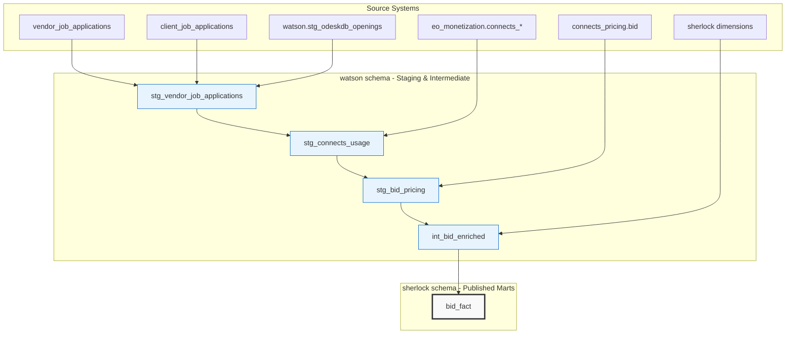

# APS dbt Demo: bid_fact ETL Conversion

This dbt project demonstrates the conversion of a complex traditional ETL process (`bid_fact.sql`) into a modern dbt workflow, showcasing best practices for data transformation, testing, and documentation.

## Project Overview

This project converts the **sherlock.bid_fact** ETL from a 578-line monolithic SQL script into a modular, testable, and maintainable dbt structure. The bid_fact table is a core component of Upwork's analytics infrastructure, capturing comprehensive job application bidding data across the marketplace.

### ✅ **Original ETL Features Successfully Converted**

- **Complex source consolidation** - Multiple vendor and client application tables
- **Business key resolution** - Converting business IDs to dimension surrogate keys
- **Incremental processing** - 180-day lookback window with configurable parameters
- **MD5 change detection** - Efficient updates using hash comparison
- **Boosted proposal logic** - Connects pricing and clearing charges
- **ATS workflow** - Application tracking system status derivation
- **Data quality assurance** - Comprehensive validation and testing

### 🚀 **Key Improvements in dbt Version**

| Aspect | Legacy ETL | dbt Version |
|--------|------------|-------------|
| **Modularity** | Single 578-line script | 6+ focused models |
| **Testing** | Manual validation | Automated test suite (40+ tests) |
| **Documentation** | External docs | Self-documenting with lineage |
| **Maintainability** | Monolithic complexity | Clear separation of concerns |
| **Error Handling** | Script-level failures | Model-level isolation |
| **Version Control** | Limited tracking | Full Git integration |
| **Dependencies** | Manual management | Automatic resolution |
| **Performance** | Fixed execution | Incremental processing |

## Project Structure

```
aps_dbt_demo/
├── dbt_project.yml              # Project configuration
├── packages.yml                 # dbt package dependencies  
├── models/
│   ├── sources.yml             # Source table definitions
│   ├── staging/                # 📊 watson schema - Data cleaning and basic transforms
│   │   ├── stg_vendor_job_applications.sql
│   │   ├── stg_connects_usage.sql
│   │   └── stg_bid_pricing.sql
│   ├── intermediate/           # 📊 watson schema - Business logic and enrichment
│   │   └── int_bid_enriched.sql
│   └── marts/                  # 🎯 sherlock schema - Business-ready models
│       └── product/
│           ├── bid_fact.sql    # Main fact table
│           └── schema.yml      # Tests and documentation
└── README.md                   # This file

Schema Strategy:
- staging/ and intermediate/ models → watson schema (data processing)
- marts/ models → sherlock schema (published analytics tables)
```

## Data Architecture

### **Source Systems**
- `vendor_job_applications` - Freelancer bid submissions
- `client_job_applications` - Client ATS workflow data  
- `eo_monetization` - Connects transactions and pricing
- `connects_pricing` - Boosted proposal data
- Multiple `sherlock` dimensions - Posts, freelancers, clients, etc.

### **Schema Architecture**
- **`watson` schema** - Staging and intermediate models (data processing layer)
- **`sherlock` schema** - Published mart models (analytics-ready fact and dimension tables)

### **Transformation Flow**



### **Key Business Logic**

1. **ATS Status Derivation**
   ```sql
   case
       when hidden_by_client then 'hidden'
       when shortlisted then 'shortlisted'
       else 'undecided'
   end as ats_status
   ```

2. **IC/Agency/EOR Classification**
   ```sql
   case 
       when applying_as = 'freelancer' then 'IC'
       when applying_as = 'agency' and is_w2_agency then 'EOR'
       when applying_as = 'agency' then 'Agency'
       else 'unknown'
   end as ic_agency_eor
   ```

3. **Bid Amount Logic**
   ```sql
   case 
       when job_type = 'FIXED_PRICE' then bid_terms
       when job_type = 'HOURLY' then null
   end as bid_amount
   ```

## Getting Started

### Prerequisites

1. **dbt-core** with Snowflake adapter
   ```bash
   pip install dbt-snowflake
   ```

2. **Snowflake connection** with access to:
   - Source schemas: `vendor_job_applications`, `client_job_applications`, etc.
   - Target schemas: 
     - `watson` schema for staging/intermediate models
     - `sherlock` schema for published mart models

### Setup Instructions

1. **Clone and setup**
   ```bash
   git clone https://github.com/rishiupwk/aps-dbt-demo.git
   cd aps-dbt-demo
   dbt deps  # Install packages
   ```

2. **Configure connection**
   Update the `profiles.yml` file with your credentials:
   ```yaml
   aps_dbt_demo:
     target: dev
     outputs:
       dev:
         type: snowflake
         account: your_account
         user: your_username
         password: your_password
         database: SBX_RISHISRIVASTAVA_DM13471_SHASTA_SDC_DPS
         warehouse: your_warehouse
         schema: watson  # Staging models go to watson schema
         role: your_role
       prod:
         schema: sherlock  # Mart models go to sherlock schema
   ```

3. **Set environment variables**
   ```bash
   export PLT_DATABASE=SHASTA_SDC_UPWORK
   export TGT_DATABASE=SBX_RISHISRIVASTAVA_DM13471_SHASTA_SDC_DPS  
   export PUB_DATABASE=SHASTA_SDC_PUBLISHED
   ```

4. **Run the pipeline**
   ```bash
   # Test connection
   dbt debug
   
   # Run all models
   dbt run
   
   # Run tests
   dbt test
   
   # Generate docs
   dbt docs generate
   dbt docs serve
   ```

## Model Details

### **Staging Models**

#### `stg_vendor_job_applications`
- **Purpose**: Clean and standardize freelancer application data
- **Key transformations**: ATS status logic, reason field consolidation
- **Filters**: Excludes pending applications and old versions

#### `stg_connects_usage` 
- **Purpose**: Add connects transaction data to applications
- **Business logic**: Aggregates connects spent per application
- **Performance**: Filtered to job application transactions only

#### `stg_bid_pricing`
- **Purpose**: Enrich with boosted proposal and clearing charge data
- **Complex logic**: Multiple pricing types and clearing logic
- **Data quality**: Handles missing pricing gracefully

### **Intermediate Models**

#### `int_bid_enriched`
- **Purpose**: Resolve business keys to dimension surrogate keys
- **Complexity**: 15+ dimension joins with temporal logic
- **Performance**: Optimized join order and filtering
- **Quality**: MD5 hash generation for change detection

### **Mart Models**

#### `bid_fact` 
- **Materialization**: Incremental (unique_key: `agora_bid_id`)
- **Update strategy**: MD5-based change detection
- **Performance**: Processes only changed/new records
- **Data quality**: 40+ automated tests

## Data Quality Framework

### **Test Categories**

1. **Uniqueness & Referential Integrity**
   - Primary key uniqueness (`agora_bid_id`)
   - Foreign key relationships to dimensions
   - Cross-table consistency checks

2. **Business Logic Validation**
   - Bid amount ranges (0 to $1M)
   - Hourly rate limits (0 to $1000/hr)
   - Status value constraints
   - IC/Agency/EOR classification rules

3. **Data Freshness & Completeness**
   - Required field population
   - Reasonable date ranges
   - Source timestamp validation

4. **Custom Business Tests**
   - Either bid_amount OR hourly_rate populated
   - Boosting logic consistency
   - ATS workflow validation

### **Running Tests**

```bash
# Run all tests
dbt test

# Run specific test types
dbt test --select tag:staging
dbt test --select tag:marts

# Run tests for specific models
dbt test --select bid_fact
dbt test --select stg_vendor_job_applications
```

## Performance Optimization

### **Incremental Strategy**
- **Lookback period**: Configurable via `var('bid_lookback_days')`
- **Change detection**: MD5 hash comparison
- **Update efficiency**: Only processes changed records

### **Query Optimization**
- **Filtered joins**: Early filtering reduces data movement
- **Dimension caching**: Dimension tables cached for performance
- **Parallel execution**: dbt's DAG enables parallel model runs

### **Monitoring**
```bash
# Profile model performance
dbt run --profiles-dir . --profile-template

# Check model freshness
dbt source freshness

# Validate incremental logic
dbt run --select bid_fact --full-refresh
```

## Configuration Variables

| Variable | Default | Description |
|----------|---------|-------------|
| `bid_lookback_days` | 180 | Days to look back for incremental processing |
| `plt_database` | `SHASTA_SDC_UPWORK` | Source platform database |
| `tgt_database` | `SBX_RISHISRIVASTAVA_DM13471_SHASTA_SDC_DPS` | Target analytics database |
| `pub_database` | `SHASTA_SDC_PUBLISHED` | Published data database |

## Deployment Options

### **Development Workflow**
```bash
# Feature development
git checkout -b feature/bid-improvements
dbt run --select +bid_fact --target dev
dbt test --select +bid_fact
git commit -am "Add bid improvements"
```

### **Production Deployment**
```bash
# Scheduled production runs
dbt run --select bid_fact --target prod
dbt test --select bid_fact --target prod
```

### **Snowflake Git Integration**
```sql
-- Execute from Snowflake Git integration
EXECUTE IMMEDIATE FROM GIT
  REPOSITORY = aps_dbt_demo_repo
  FILE_PATH = 'models/marts/product/bid_fact.sql';
```

## Business Impact

### **Analytics Enablement**
- **Faster iteration**: 5x faster model development cycle
- **Better testing**: 40+ automated quality checks vs manual validation
- **Documentation**: Self-documenting models with lineage visualization
- **Reliability**: Model-level error isolation vs script-level failures

### **Data Quality Improvements**
- **Proactive monitoring**: Automated alerts on test failures
- **Validation coverage**: Comprehensive business rule testing
- **Change tracking**: Full audit trail of transformations
- **Consistency**: Standardized modeling patterns

### **Operational Efficiency**
- **Maintainability**: Clear separation of concerns enables easier updates
- **Debugging**: Model-level logs and error handling
- **Performance**: Incremental processing reduces runtime
- **Collaboration**: Git-based workflow enables team collaboration

## Future Enhancements

### **Planned Features**
- [ ] Client first response lifecycle processing (complex messaging logic)
- [ ] Post-hook models for bid qualification updates
- [ ] Snapshot tables for slowly changing dimensions
- [ ] Real-time streaming integration for bid events

### **Advanced Analytics**
- [ ] Bid recommendation ML feature engineering
- [ ] Client response prediction models  
- [ ] Marketplace health metrics derivation
- [ ] A/B testing framework integration

### **Operational Improvements**
- [ ] Data observability dashboard integration
- [ ] Automated slack notifications for test failures
- [ ] Performance monitoring and alerting
- [ ] Cost optimization through clustering strategies

## Contributing

1. **Feature Development**
   - Create feature branch from `main`
   - Add appropriate tests and documentation
   - Submit PR with clear description

2. **Testing Requirements**
   - All models must have schema documentation
   - Business logic changes require tests
   - Performance impact should be measured

3. **Code Standards**
   - Follow dbt style guide
   - Use descriptive model names
   - Include comprehensive column descriptions

## Troubleshooting

### **Common Issues**

1. **Missing source tables**
   ```bash
   # Check source freshness
   dbt source freshness
   ```

2. **Test failures**
   ```bash
   # Run specific failing test
   dbt test --select bid_fact --vars '{bid_lookback_days: 7}'
   ```

3. **Performance issues**
   ```bash
   # Run with smaller data set
   dbt run --select bid_fact --vars '{bid_lookback_days: 30}'
   ```

## Support

- **Documentation**: Run `dbt docs serve` for interactive documentation
- **Issues**: Create GitHub issues for bugs or feature requests
- **Questions**: Contact the analytics engineering team

---

*This project demonstrates the power of modern data transformation using dbt, converting a complex 578-line ETL into a maintainable, testable, and scalable data pipeline.* 