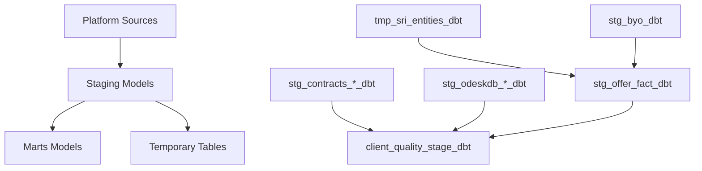

# Upwork APS dbt Demo - Watson Staging Schema Conversion

This dbt project demonstrates the modernization of Upwork's legacy SQL ETL processes by converting the `watson_staging_schema.sql` into modular, testable, and maintainable dbt models.

## 📋 Project Overview

This project converts the traditional monolithic `watson_staging_schema.sql` file into a comprehensive dbt project with proper dependency management, testing, and documentation. Each target table is postfixed with `_dbt` to distinguish the dbt-generated tables from legacy ones.

### 🎯 Key Benefits
- **Modularity**: Break down complex SQL into reusable components
- **Testing**: Built-in data quality tests and validation
- **Documentation**: Self-documenting models with business context
- **Version Control**: Git-based development workflow
- **Dependency Management**: Automatic dependency resolution
- **Environment Management**: Separate dev/prod configurations

## 📁 Project Structure

```
models/
├── staging/                           # Staging layer models
│   ├── stg_contracts_hourly_limit_terms_dbt.sql  # Contract hourly limits
│   ├── stg_odeskdb_companies_dbt.sql             # Legacy company data
│   ├── stg_odeskdb_agencies_dbt.sql              # Legacy agency data
│   ├── stg_odeskdb_openings_dbt.sql              # Complex job openings with enrichments
│   ├── stg_project_dim_dbt.sql                   # Project dimension data
│   ├── tmp_sri_entities_dbt.sql                  # Scheduled Rate Increase entities
│   ├── stg_byo_dbt.sql                           # Bring Your Own relationships
│   ├── stg_offer_fact_dbt.sql                    # Complex offer fact with JSON parsing
│   ├── stg_internal_company_users_dbt.sql        # Internal company users
│   └── stg_tns_device_mgmt_device_ids_dbt.sql    # Incremental device tracking
├── marts/                             # Published data models
│   └── client_quality_stage_dbt.sql              # Client quality staging
├── sources.yml                       # Source table definitions
├── packages.yml                      # External package dependencies
├── dbt_project.yml                  # Project configuration
└── profiles.yml                     # Database connection settings
```

## 🔄 Data Architecture



## 🏗️ Model Categories

### Simple Passthrough Models
- `stg_contracts_hourly_limit_terms_dbt`: Direct copy from contracts schema
- `stg_odeskdb_companies_dbt`: Legacy ODesk company data
- `stg_odeskdb_agencies_dbt`: Legacy ODesk agency data  
- `stg_project_dim_dbt`: Project dimension data

### Complex Transformation Models
- `stg_odeskdb_openings_dbt`: Job openings with qualifications, featured job pricing, location enrichment
- `stg_offer_fact_dbt`: Offer data with JSON parsing, BYO relationship detection, SRI calculations
- `stg_byo_dbt`: Bring Your Own and Manage & Pay relationship logic
- `client_quality_stage_dbt`: Client quality scoring from multiple sources

### Specialized Models
- `tmp_sri_entities_dbt`: Scheduled Rate Increase entity filtering
- `stg_internal_company_users_dbt`: Internal company/user unpivoting logic
- `stg_tns_device_mgmt_device_ids_dbt`: Incremental device tracking

## 🚀 Setup Instructions

### Prerequisites
- Snowflake account with appropriate permissions
- dbt installed (or use Snowflake's native dbt)
- Access to source databases: `SHASTA_SDC_UPWORK` (platform) and `SBX_RISHISRIVASTAVA_DM13471_SHASTA_SDC_DPS` (target)

### Configuration

1. **Update credentials in `profiles.yml`:**
   ```yaml
   aps_dbt_demo:
     target: dev
     outputs:
       dev:
         type: snowflake
         account: upwork-prod
         user: rishisrivastava
         password: YOUR_PASSWORD_HERE
         role: user_rishisrivastava_role
         database: SBX_RISHISRIVASTAVA_DM13471_SHASTA_SDC_DPS
         warehouse: SNOW_APS_WH
         schema: sherlock
   ```

2. **Environment Variables (Optional):**
   ```bash
   PLT_DATABASE=SHASTA_SDC_UPWORK
   TGT_DATABASE=SBX_RISHISRIVASTAVA_DM13471_SHASTA_SDC_DPS
   PUB_DATABASE=SHASTA_SDC_PUBLISHED
   ```

### Installation & Execution

```bash
# Install dependencies
dbt deps

# Test connection  
dbt debug

# Compile models
dbt compile

# Run all models
dbt run

# Run tests
dbt test

# Generate documentation
dbt docs generate
dbt docs serve
```

## 📊 Key Model Details

### stg_odeskdb_openings_dbt
- **Purpose**: Enriched job opening data with qualifications and geographic info
- **Key Features**: JSON parsing for location data, featured job pricing, AI-generated post detection
- **Dependencies**: 8+ source tables with complex joins

### stg_offer_fact_dbt  
- **Purpose**: Comprehensive offer tracking with business logic
- **Key Features**: JSON parsing for offer terms, BYO relationship detection, SRI calculations
- **Dependencies**: References other dbt models (`stg_byo_dbt`, `tmp_sri_entities_dbt`)

### client_quality_stage_dbt
- **Purpose**: Client quality scoring from multiple ML sources
- **Key Features**: UNION logic combining FJP LTV and CLTVv2 data
- **Output**: Ranked client quality predictions

## 🔧 Configuration Variables

| Variable | Default | Description |
|----------|---------|-------------|
| `plt_database` | `SHASTA_SDC_UPWORK` | Platform source database |
| `tgt_database` | `SBX_RISHISRIVASTAVA_DM13471_SHASTA_SDC_DPS` | Target database |
| `pub_database` | `SHASTA_SDC_PUBLISHED` | Published database |
| `timezone` | `UTC` | Timezone for date calculations |

## 🎯 Deployment Options

### Development
```bash
dbt run --target dev
```

### Production  
```bash
dbt run --target prod
```

### Specific Models
```bash
# Run staging models only
dbt run --select tag:staging

# Run watson models only  
dbt run --select tag:watson

# Run single model and dependencies
dbt run --select +stg_offer_fact_dbt
```

## 📈 Business Impact

### Before (Legacy SQL)
- ❌ Monolithic 283-line SQL file
- ❌ Manual dependency management
- ❌ No testing framework
- ❌ Limited reusability
- ❌ Difficult to debug/maintain

### After (dbt Models)
- ✅ 10+ modular, focused models
- ✅ Automatic dependency resolution
- ✅ Built-in testing framework
- ✅ Reusable components
- ✅ Clear lineage and documentation
- ✅ Version controlled development

## 🔮 Future Enhancements

1. **Enhanced Testing**: Add custom business logic tests
2. **Snapshots**: Implement SCD for dimensional data
3. **Incremental Models**: Optimize large table processing
4. **Macros**: Create reusable SQL components
5. **Seeds**: Add reference data management
6. **CI/CD**: Automated testing and deployment

## 🛠️ Troubleshooting

### Common Issues
1. **Missing credentials**: Update `profiles.yml` with your Snowflake credentials
2. **Source access**: Ensure role has access to source schemas
3. **Package dependencies**: Run `dbt deps` to install required packages

### Performance Tips
- Use `--select` flags to run specific models
- Monitor warehouse usage during full runs
- Consider incremental models for large datasets

---

**Need Help?** Contact the Data Engineering team or refer to [dbt documentation](https://docs.getdbt.com/). 